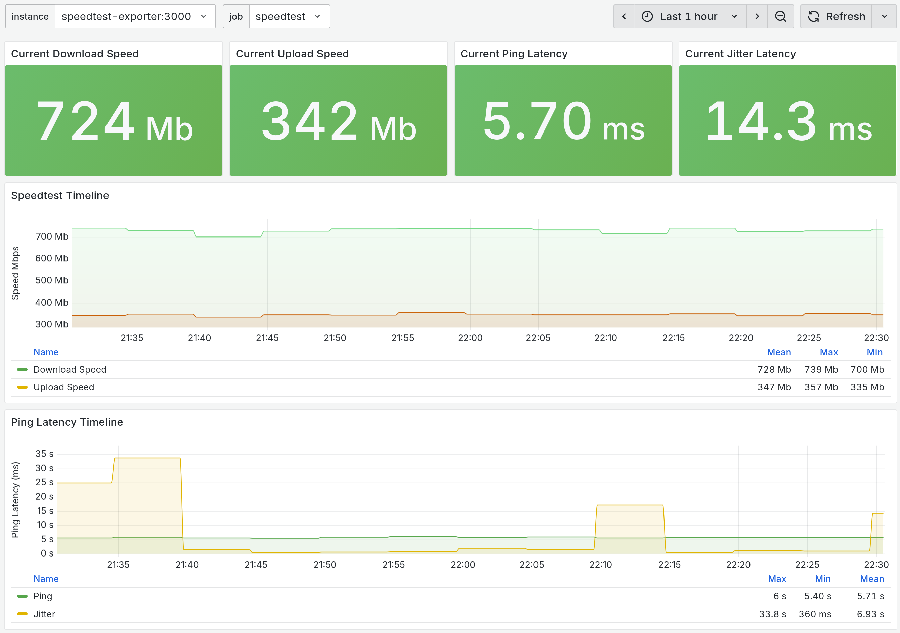

# Unifique Speedtest Exporter


This project turns the [Unifique Speed Test](https://speed.unifique.com.br/) into a Prometheus metrics endpoint.

> This is mostly a Proof of Concept. I still plan to move away from Playwright and Node. However right now I just want a quick and easy way to record speed test metrics.

## How to use

The project can be run locally using Docker or Docker Compose. Follow the instructions below for your preferred method.

### Using Docker

1. Pull the latest image from the GitHub Container Registry:

   ```bash
   docker pull ghcr.io/mateuxlucax/unifique-speedtest-exporter:latest
   ```

2. Run the container:

   ```bash
   docker run -p 3000:3000 ghcr.io/mateuxlucax/unifique-speedtest-exporter:latest
   ```

The exporter will be available at http://localhost:3000/metrics

### Docker Compose

If you wish to setup this in a Docker Compose environment you can check the [docker-compose.yml](docker-compose.yml) file for an example configuration.

## Metrics

The following metrics are exposed:

- `speed_download_bits_per_second`: Download speed in bits per second
- `speed_upload_bits_per_second`: Upload speed in bits per second
- `speed_ping_ms`: Ping time in milliseconds
- `speed_jitter_ms`: Jitter time in milliseconds

### Prometheus configuration

```yaml
scrape_configs:
  - job_name: 'unifique_speedtest_exporter'
    scrape_interval: 10m
    scrape_timeout: 2m
    static_configs:
      - targets: ['localhost:3000']
```

### Grafana panel

You can also visualize the metrics in Grafana by importing the [Grafana dashboard JSON file](assets/grafana/unifique-speedtest-grafana-dashboard.json). Here is a preview:




## Development & Contribution

To contribute to the project, first clone it then follow these steps:

1. Install dependencies:
```bash
npm install
```

2. Run the development server:
```bash
npm run dev
```

3. Make your changes and test them locally.

4. Submit a pull request with a description of your changes.

## License

This project is licensed under the GPL-3.0 License - see the [LICENSE](LICENSE) file for details.
