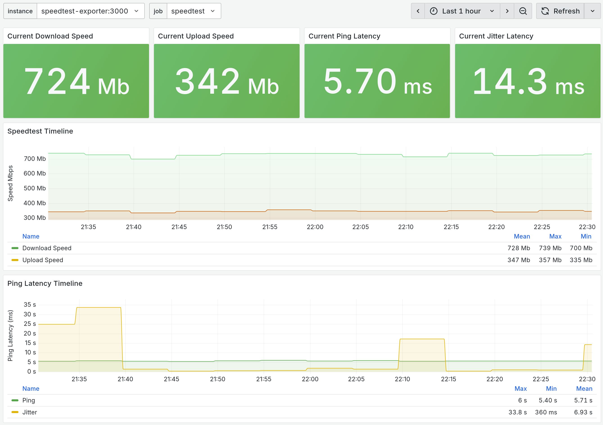

# Unifique Speedtest Exporter


This project turns the [Unifique Speed Test](https://speed.unifique.com.br/) into a Prometheus metrics endpoint.

The Unifique speed test is a stock [LibreSpeed](https://github.com/librespeed/speedtest) deployment, so the whole test is just concurrent HTTP requests against its `garbage.php` / `empty.php` backend. This exporter is a small, dependency-free Go program that speaks the LibreSpeed HTTP protocol directly. The test runs in the background on an interval and the results are cached, so every Prometheus scrape returns instantly instead of triggering a fresh, link-saturating test.

> **Note:** like opening the speed test in a browser, the exporter measures the connection of the machine it runs on against Unifique's servers — so run it on the connection you want to monitor.

## How to use

The project can be run locally using Docker or Docker Compose. Follow the instructions below for your preferred method.

### Using Docker

1. Pull the latest image from the GitHub Container Registry:

   ```bash
   docker pull ghcr.io/mateuxlucax/unifique-speedtest-exporter:latest
   ```

2. Run the container:

   ```bash
   docker run -p 3000:3000 ghcr.io/mateuxlucax/unifique-speedtest-exporter:latest
   ```

The exporter will be available at http://localhost:3000/metrics

### Docker Compose

Two compose files are provided:

- **Easy replication** — pull and run the prebuilt image from GHCR ([docker-compose.yml](docker-compose.yml)):

  ```bash
  docker compose up -d
  ```

- **Build from source** — build the image locally, no published image required ([docker-compose.build.yml](docker-compose.build.yml)):

  ```bash
  docker compose -f docker-compose.build.yml up -d --build
  ```

Both expose `/metrics` on port 3000 and accept the same environment variables (see [Configuration](#configuration)).

> The first scrape returns zeros until the initial background test finishes (~50 s); after that, `/metrics` serves the cached result instantly.

## Metrics

The following metrics are exposed:

- `speed_download_bits_per_second`: Download speed in bits per second
- `speed_upload_bits_per_second`: Upload speed in bits per second
- `speed_ping_ms`: Ping time in milliseconds
- `speed_jitter_ms`: Jitter time in milliseconds

Plus exporter health metrics:

- `speed_test_success`: `1` if the last test succeeded, `0` otherwise
- `speed_test_duration_seconds`: how long the last test run took
- `speed_test_last_run_timestamp_seconds`: Unix timestamp of the last run

### Configuration

The exporter is configured via environment variables:

| Variable | Default | Description |
| --- | --- | --- |
| `PORT` | `3000` | Port the `/metrics` endpoint listens on |
| `SPEEDTEST_URL` | `https://speed.unifique.com.br` | LibreSpeed origin to test against |
| `RUN_INTERVAL` | `10m` | How often to run the test in the background (Go duration, e.g. `5m`, `1h`) |

### Prometheus configuration

```yaml
scrape_configs:
  - job_name: 'unifique_speedtest_exporter'
    scrape_interval: 10m
    scrape_timeout: 2m
    static_configs:
      - targets: ['localhost:3000']
```

### Grafana panel

You can also visualize the metrics in Grafana by importing the [Grafana dashboard JSON file](assets/grafana/unifique-speedtest-grafana-dashboard.json). Here is a preview:




## Development & Contribution

The exporter is a standard Go module ([mise](https://mise.jdx.dev/) pins the toolchain via `mise.toml`).

1. Run the tests:
```bash
go test ./...
```

2. Run it locally (must be on a Unifique connection to get real results):
```bash
go run .
# then: curl http://localhost:3000/metrics
```

3. Make your changes, then submit a pull request with a description of them.

## License

This project is licensed under the GPL-3.0 License - see the [LICENSE](LICENSE) file for details.
